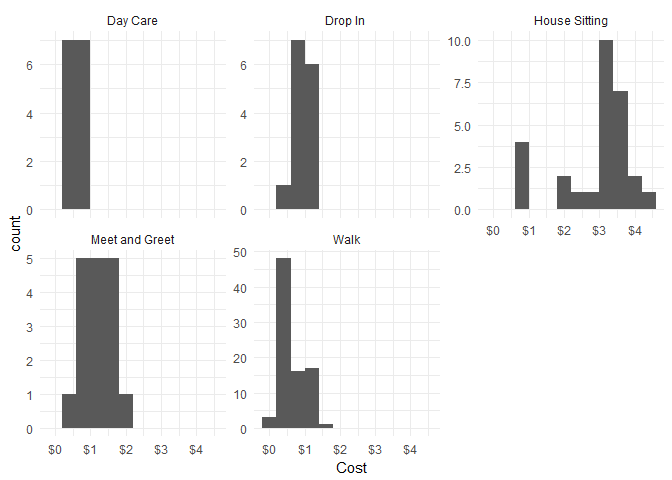
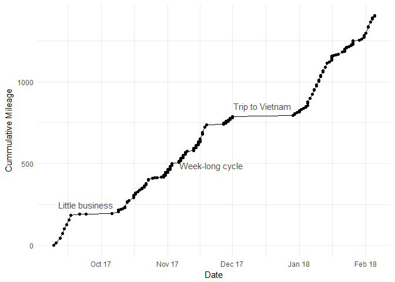

My Mileage with Rover
================

Data collected and compiled by Shelby Richins

``` r
setwd('C:/Users/Shelby/Desktop/EDA/Rover')

library(ggplot2)
library(ggthemes)
library(scales)

df = read.csv('Rover_mileage.csv')
```

Total Mileage
-------------

From 2017/09/09 to 2018/01/26

``` r
sum(df$Mileage)
```

    ## [1] 1403

### Mileage by Service Type

``` r
by(df$Mileage, df$Service, sum)
```

    ## df$Service: Day Care
    ## [1] 60
    ## -------------------------------------------------------- 
    ## df$Service: Drop In 
    ## [1] 106
    ## -------------------------------------------------------- 
    ## df$Service: House Sitting
    ## [1] 642
    ## -------------------------------------------------------- 
    ## df$Service: Meet and Greet
    ## [1] 168
    ## -------------------------------------------------------- 
    ## df$Service: Walk
    ## [1] 427

``` r
# boxplots of mileage by service type
ggplot(aes(y = Mileage, x = Service), data = df) +
  geom_boxplot() +
  theme_minimal()
```


Fuel Costs
----------

``` r
# Total cost of fuel
sum(df$Cost)
```

    ## [1] 175.3676

``` r
# histogram of cost by service type
ggplot(aes(x = Cost), data = df) +
  geom_histogram(binwidth = 0.5) +
  theme_minimal() +
  scale_x_continuous(labels = dollar_format(prefix="$")) +
  facet_wrap(~Service, scales = 'free_y', ncol = 3)
```



Mileage through Time
--------------------

``` r
# format date column
df$Date_formatted <- strptime(df$Date, format = '%m/%d/%Y')
# order by date
df = df[order(df$Date_formatted),]

# plot
ggplot(aes(x = Date_formatted, y = cumsum(Mileage)), data = df) +
  geom_line() +
  scale_y_continuous("Cummulative Mileage") +
  scale_x_datetime("Date", labels=date_format("%b %y")) +
  geom_point() +
  annotate("text", color = 'grey30',
           x = strptime(c("12-15-2017", "09-24-2017", "11-21-2017"), format = '%m-%d-%Y'), 
           y = c(850, 250, 490), 
           label = c('Trip to Vietnam', 'Little business', 'Week-long cycle')) +
  theme_minimal()
```



### Cumulative Mileage by Service Type

Large amount of Mileage gained doing walks in November 2017 and while House Sitting in January 2018

``` r
# calculate cummulative sum by service type
df$csum <- ave(df$Mileage, df$Service, FUN=cumsum)

# plot
ggplot(aes(x = Date_formatted, y = csum, color = Service), data = df) +
  geom_line() +
  scale_y_continuous("Cummulative Mileage") +
  scale_x_datetime("Date", labels=date_format("%b %y")) +
  geom_point() +
  theme_minimal() 
```


